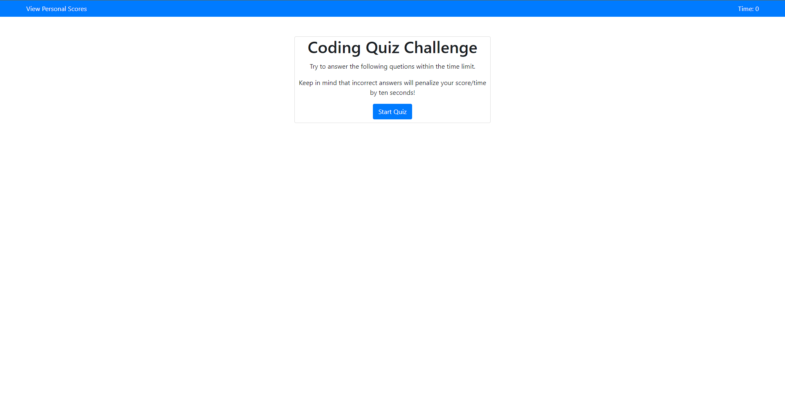

# Code Quiz

## About this App

### Description

This application is a coding quiz website that you can use to test your skills on different topics regarding
Web Development. Each quiz is timed and scores are kept track on a leaderboard.

### User Story

As a user looking for a way to practice interview questions, I would like an application that allows me to review differnt questions regarding web development. When I am on the homepage, I am presented with the a start button for the quiz. Once I start the quiz, the countdown timer begins and time is reduced if I answer a question wrong. At the end of the quiz, I have the option to save my score to the leaderboard.

### Features

* Users can interact with the different buttons on the screen to progress through the quiz.
* At the end of a quiz, users can interact with a form to save their score and initials to local storage.

### Built With

- HTML
- CSS
- BootStrap
- JavaScipt

## Deployed Application

<a href="https://calebfunderburk.github.io/Code-Quiz/" target="_blank">Click here</a> to view this application.

## Installation

This program can be run through a browser using the above link to the deployed application. In order to run this program locally you will need to:

* Clone this repository to receive all the files.

## Screenshot

## Contributions

Made by Caleb Funderburk
